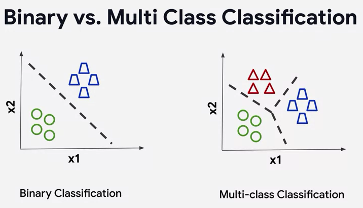

# Transfer Learning for Multi-Class Classification on CIFAR-10 Dataset

This repository contains code and resources for performing multi-class classification on the CIFAR-10 dataset using transfer learning. Transfer learning is a powerful technique that leverages the knowledge learned from pre-trained models on large datasets to solve new tasks with smaller datasets.

## Table of Contents
- [Introduction](#introduction)
- [CIFAR-10 Dataset](#cifar-10-dataset)
- [Transfer Learning](#transfer-learning)
- [Binary Classification vs. Multi-Class Classification](#binary-classification-vs-multi-class-classification)
- [Getting Started](#getting-started)
- [Results](#results)
- [Contributing](#contributing)
- [License](#license)

## Introduction
In many real-world scenarios, acquiring a large labeled dataset for training deep neural networks from scratch can be time-consuming and resource-intensive. Transfer learning comes to the rescue by allowing us to leverage pre-trained models, which have already learned rich feature representations from massive datasets like ImageNet, and adapt them to solve new tasks with smaller datasets.

This project demonstrates how to perform multi-class classification on the CIFAR-10 dataset using transfer learning. By using a pre-trained model as a feature extractor, we can train a classifier on the CIFAR-10 dataset with improved accuracy and reduced training time.

## CIFAR-10 Dataset
The CIFAR-10 dataset is a popular benchmark dataset for image classification tasks. It consists of 60,000 color images in 10 classes, with 6,000 images per class. The images are of size 32x32 pixels, and each image belongs to one of the following classes: airplane, automobile, bird, cat, deer, dog, frog, horse, ship, and truck.

## Transfer Learning
Transfer learning involves taking a pre-trained model, removing the final classification layer(s), and replacing them with a new classifier suited for the specific task. The pre-trained model acts as a feature extractor, capturing high-level features from the input images. These features are then fed into the new classifier to make predictions on the target dataset.

In this project, we will use a pre-trained convolutional neural network (CNN), such as VGG, ResNet, or Inception, as the feature extractor. We will freeze the pre-trained layers to prevent their weights from being updated during training, and only train the new classifier layers. By doing so, we can leverage the pre-trained model's knowledge and adapt it to the CIFAR-10 dataset efficiently.

## Binary Classification vs. Multi-Class Classification

In machine learning, classification tasks are divided into two main categories: binary classification and multi-class classification. The primary difference between the two lies in the number of classes or categories being predicted.

### Binary Classification
Binary classification involves predicting one of two possible classes or categories. The goal is to classify an input instance into one of the two classes based on the given features. Common examples of binary classification include spam detection (classifying emails as spam or not spam), fraud detection (classifying transactions as fraudulent or legitimate), and sentiment analysis (classifying text as positive or negative).

The binary classification problem can be framed as assigning a probability to each class, where the sum of the probabilities equals 1. The decision boundary separates the feature space into two regions, each corresponding to one of the classes. Techniques like logistic regression, support vector machines (SVMs), and decision trees are commonly used for binary classification.

### Multi-Class Classification
In contrast, multi-class classification involves predicting an input instance's class or category from three or more possible classes. The task is to assign the correct class label to the input

 based on its features. Examples of multi-class classification tasks include image recognition (classifying objects into various categories), document classification (classifying articles into different topics), and handwritten digit recognition (classifying digits from 0 to 9).

Multi-class classification can be approached in different ways. One approach is the one-vs-rest (or one-vs-all) strategy, where a separate binary classifier is trained for each class. Each classifier is responsible for distinguishing its corresponding class from the rest. Another approach is the one-vs-one strategy, where a binary classifier is trained for every pair of classes. The final prediction is determined through a voting scheme. Algorithms like logistic regression, random forests, and gradient boosting are commonly used for multi-class classification.

It's important to note that binary classification can be seen as a special case of multi-class classification, where the number of classes is two. Therefore, techniques used in binary classification can often be applied to multi-class problems as well.

Understanding the distinction between binary classification and multi-class classification is crucial when choosing appropriate models and evaluation metrics for different types of classification tasks.

## Getting Started
To get started with this project, follow these steps:

1. Click this link to open the notebook in Colab: https://colab.research.google.com/github/barzansaeedpour/transfer-learning-for-multi-class-classification-CIFAR-10/blob/main/Transfer_Learning_CIFAR_10.ipynb

2. The instruction and explaination of the code is mentioned in the notebook

## Results
After training the transfer learning model and evaluating it on the test set, you can report the classification accuracy, confusion matrix, and any other relevant metrics. Include visualizations or graphs if necessary to demonstrate the model's performance.

## Contributing
Contributions to this project are welcome. If you find any issues or have suggestions for improvements, please open an issue or submit a pull request.

## License
This project is licensed under the [MIT License](LICENSE). Feel free to use and modify the code for your own purposes.